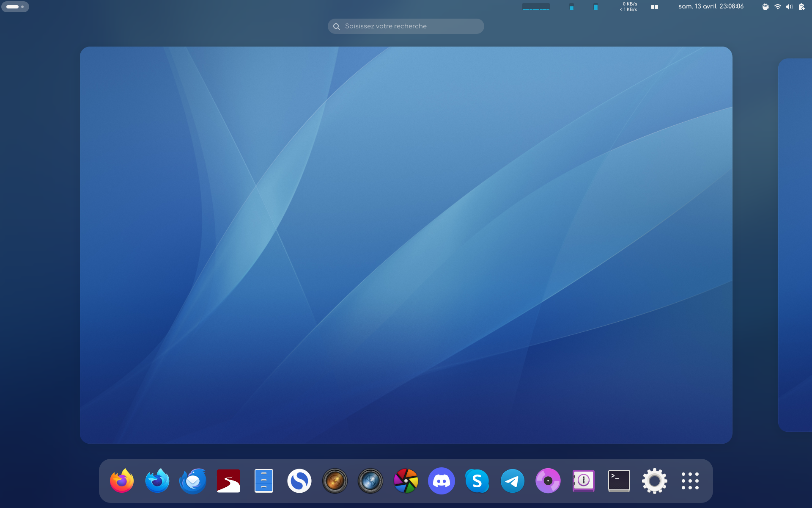
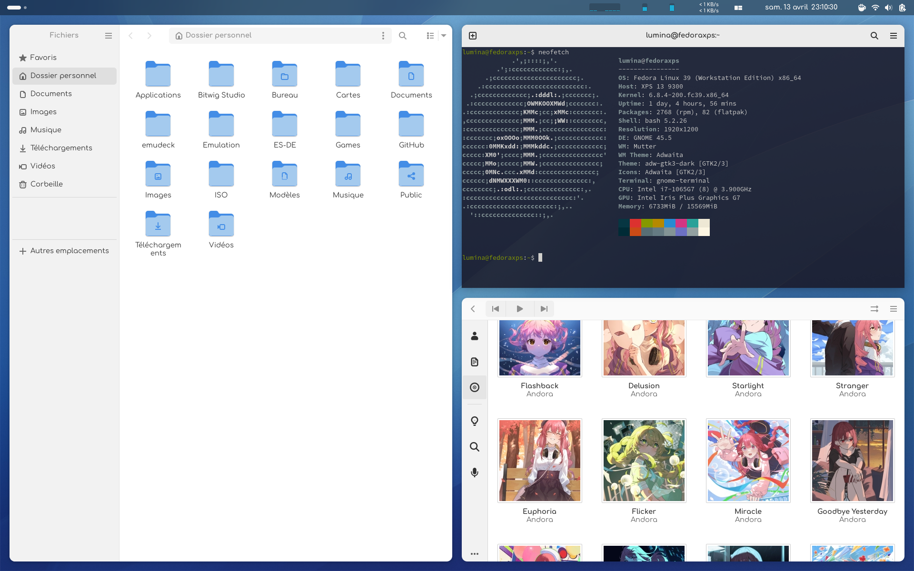
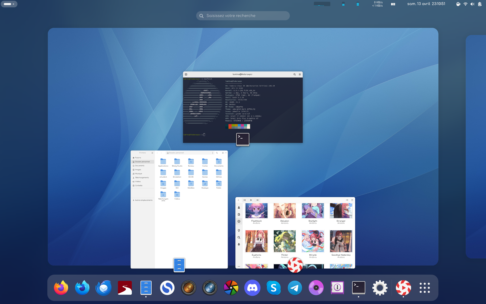

# Script install of my Fedora 39
#### MAJ 2024/04/13

### You need
1/ Fedora Workstation 39 with GNOME  
2/ An internet connection      
3/ Time    

### Install
1/ Download script    
2/ Unzip   
3/ Open Terminal, go to the folder and execute   
4/ ```chmod -R 755 Fedora_WS``` for execute my script   
5/ and for run  ```./"Fedora_WS/start.sh"```            

  
  
  
